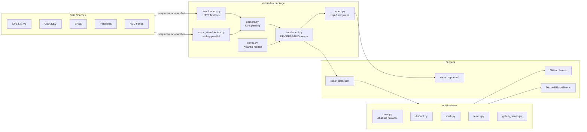

<p align="center">
  
  <h1 align="center">VulnRadar</h1>
  <p align="center">
    <strong>Your personal vulnerability intelligence radar — fork, configure, and go!</strong>
  </p>
  <p align="center">
    <a href="https://github.com/RogoLabs/VulnRadar/blob/main/LICENSE"></a>
    
    <a href="https://github.com/RogoLabs/VulnRadar/actions/workflows/ci.yml"></a>
    <a href="https://github.com/RogoLabs/VulnRadar/actions/workflows/update.yml"></a>
    <a href="https://github.com/RogoLabs/VulnRadar/actions/workflows/notify.yml"></a>
  </p>
</p>

---

## 📡 Live Threat Dashboard

<div align="center">

<!-- METRICS START -->
| 📊 **CVEs Tracked** | 🚨 **Critical** | ⚠️ **In KEV** | 🔥 **Exploit Intel** |
|:---:|:---:|:---:|:---:|
| 2589 | 44 | 631 | 648 |

_Last scanned: 2026-02-27 19:42 UTC_
<!-- METRICS END -->

</div>

<table>
<tr>
<td width="25%" align="center">
<br/>
<sub>Matching your watchlist</sub>
</td>
<td width="25%" align="center">
<br/>
<sub>PoC + In your stack = 🔥</sub>
</td>
<td width="25%" align="center">
<br/>
<sub>CISA confirmed active</sub>
</td>
<td width="25%" align="center">
<br/>
<sub>From PatchThis feeds</sub>
</td>
</tr>
</table>

<details>
<summary><strong>📈 What do these metrics mean?</strong></summary>

| Metric | Description | Why It Matters |
|--------|-------------|----------------|
| **CVEs Tracked** | Total CVEs matching your `watchlist.yaml` vendors/products | Your attack surface visibility |
| **Critical** | CVEs with known exploit code AND in your watchlist | **Immediate patching priority** |
| **In KEV** | Listed in CISA's Known Exploited Vulnerabilities catalog | Active exploitation in the wild |
| **Exploit Intel** | Has PoC/weaponized code (from PatchThis) | Threat actors have working exploits |

> 💡 **Tip:** These metrics auto-update every hour when the ETL workflow runs in your fork.

</details>

---

VulnRadar is a **lightweight, GitHub-native vulnerability intelligence tool** that:

- 📥 Downloads the latest CVE data from `CVEProject/cvelistV5` and NVD data feeds
- 🎯 Filters CVEs against **your** tech stack via `watchlist.yaml`
- 🔥 Enriches with [CISA KEV](https://www.cisa.gov/known-exploited-vulnerabilities-catalog), [EPSS](https://www.first.org/epss/), [NVD](https://nvd.nist.gov/), and [PatchThis](https://patchthis.app/) intelligence
- 📊 Generates a beautiful Markdown report viewable directly in GitHub
- 🚨 Creates GitHub Issues for critical findings (with escalation comments!)
- 🔔 Sends Discord/Slack/Teams notifications (optional)
- 📋 Integrates with GitHub Projects v2 for Kanban workflows (optional)
- 🎭 Includes demo mode for conference presentations

**No API keys. No external services. Just fork and go.**

---

## ⚡ Quick Start (Under 5 Minutes)

### 1️⃣ Fork this repository
Click the **Fork** button at the top right of this page.

### 2️⃣ Enable GitHub Actions

> ⚠️ **Important:** GitHub automatically disables workflows on forked repositories for security reasons. You must manually enable them.

Go to your fork → **Actions** tab → Click the green button: **"I understand my workflows, go ahead and enable them"**


### 3️⃣ Configure your watchlist
Edit `watchlist.yaml` with your tech stack:

```yaml
vendors:
  - microsoft
  - apache
  - linux

products:
  - chrome
  - log4j
  - kubernetes
```

### 4️⃣ Run the ETL
Either wait for the scheduled run (every hour) or:
- Go to **Actions** → **Update Vulnerability Radar Data** → **Run workflow**

### 5️⃣ View your report
Check `data/radar_report.md` in your fork — it renders beautifully in GitHub!

> 📺 **See it in action:** [VulnRadar-Demo](https://github.com/RogoLabs/VulnRadar-Demo) has a live example with real data.

---

## 🏗️ Architecture



---

## 📊 Data Sources

| Source | What It Provides | Update Frequency |
|--------|------------------|------------------|
| [CVE List V5](https://github.com/CVEProject/cvelistV5) | All CVE records (bulk ZIP) | Daily midnight |
| [NVD Data Feeds](https://nvd.nist.gov/vuln/data-feeds) | CVSS scores, CPE, CWE, references | Daily |
| [CISA KEV](https://www.cisa.gov/known-exploited-vulnerabilities-catalog) | Known exploited vulnerabilities | As needed |
| [EPSS](https://www.first.org/epss/) | Exploit probability scores (0-1) | Daily |
| [PatchThis](https://patchthis.app/) | Crowd-sourced exploit intelligence | Continuous |

---

## 🎯 Watchlist Configuration

VulnRadar uses `watchlist.yaml` to filter CVEs relevant to **your** tech stack.

```yaml
# Add vendors (organizations)
vendors:
  - microsoft
  - apache
  - google

# Add products (specific software)
products:
  - exchange      # Microsoft Exchange
  - log4j         # Apache Log4j
  - kubernetes    # Container orchestration

# Optional: exclude noise
exclude_vendors:
  - n/a
  - unknown

# Optional: configurable severity thresholds
thresholds:
  min_cvss: 0.0            # Include all severities
  min_epss: 0.0            # Include all exploit probabilities
  severity_threshold: 9.0  # Also flag CVEs with CVSS >= 9.0 as critical
  epss_threshold: 0.5      # Also flag CVEs with EPSS >= 50% as critical

# Optional: matching behaviour
options:
  always_include_kev: true
  always_include_patchthis: true
  match_mode: substring    # 'substring', 'exact', or 'regex'
```

**Tips:**
- Matching is **case-insensitive** and uses **substring matching** by default
- See `watchlist.example.yaml` for extensive examples by category
- Run `python etl.py --validate-watchlist` to check for typos

---

## 🚨 Priority Classification

VulnRadar automatically classifies findings:

| Priority | Condition | Action |
|----------|-----------|--------|
| 🔴 **CRITICAL** | Exploit Intel + watchlist, OR CVSS ≥ `severity_threshold`, OR EPSS ≥ `epss_threshold` | Immediate attention |
| 🟠 **WARNING** | Has Exploit Intel (PoC) but NOT in watchlist | Shadow IT risk |
| 🟡 **KEV** | In CISA KEV catalog | Active exploitation |
| ⚪ **Other** | Watchlist match only | Monitor |

> 💡 `severity_threshold` and `epss_threshold` are optional — set them in `watchlist.yaml` under `thresholds:` to expand what counts as critical beyond just exploit intel.

---

## 🔔 Notifications

### GitHub Issues (Default)
Critical findings automatically create GitHub Issues with the `vulnradar` label.

### Discord (Optional)
Add `DISCORD_WEBHOOK_URL` to your repository secrets to receive Discord alerts.
See [docs/discord.md](docs/discord.md) for setup instructions.

### Slack (Optional)
Add `SLACK_WEBHOOK_URL` to your repository secrets to receive Slack alerts.
See [docs/slack.md](docs/slack.md) for setup instructions.

### Microsoft Teams (Optional)
Add `TEAMS_WEBHOOK_URL` to your repository secrets to receive Teams alerts (Adaptive Cards).
See [docs/teams.md](docs/teams.md) for setup instructions.

### Per-Severity Routing (Optional)
Route different alert levels to different webhooks:

```yaml
# In watchlist.yaml
notifications:
  discord:
    - url: $DISCORD_CRITICAL_WEBHOOK
      filter: critical        # Only critical findings
      max_alerts: 25
    - url: $DISCORD_ALL_WEBHOOK
      filter: all             # Everything
  slack:
    - url: $SLACK_WEBHOOK_URL
      filter: kev             # Only KEV entries
```

Filters: `all` | `critical` | `kev` | `watchlist`. URLs starting with `$` are resolved from environment variables.

---

## � Advanced Features

### State Management & Deduplication
VulnRadar tracks which CVEs you've seen to avoid alert spam:
- First run creates a baseline (no spam for existing CVEs)
- Subsequent runs only alert on **new** critical CVEs
- State stored in `data/state.json`

### Issue Escalation
When an existing CVE's status changes (e.g., added to CISA KEV), VulnRadar posts an **escalation comment** on the existing issue instead of creating a duplicate.

### GitHub Projects Integration
Automatically add new issues to a GitHub Projects v2 board:
```yaml
# In notify.yml workflow
- run: python notify.py --project-url https://github.com/users/YOU/projects/1
```

### Multi-Watchlist Support
For team collaboration, use `watchlist.d/*.yaml`:
```
watchlist.d/
├── infra-team.yaml    # Infrastructure team's stack
├── appsec-team.yaml   # AppSec team's focus areas
└── soc-team.yaml      # SOC monitoring list
```
All files are merged at runtime.

### Weekly Summary Issues
Generate a weekly digest issue instead of individual alerts:
```bash
python notify.py --weekly-summary
```

### Demo Mode
For conference presentations, inject a fake critical CVE:
```bash
python notify.py --demo
```

### Severity Labels
Issues are automatically labeled by CVSS severity:
- `severity:critical` (CVSS ≥ 9.0)
- `severity:high` (CVSS ≥ 7.0)
- `severity:medium` (CVSS ≥ 4.0)

### GitHub Codespaces
One-click development environment with `.devcontainer/devcontainer.json`.

---

## �🖥️ Local Development

```bash
# Clone your fork
git clone https://github.com/YOUR_USERNAME/VulnRadar.git
cd VulnRadar

# Install dependencies
pip install -r requirements.txt

# Run the ETL
python etl.py

# View outputs
open data/radar_report.md      # Markdown report
open data/radar_data.json      # Raw JSON data
```

### CLI Options

```bash
# Scan specific year range
python etl.py --min-year 2023 --max-year 2026

# Include older KEVs outside scan window
python etl.py --include-kev-outside-window

# Skip NVD download (faster, less enrichment)
python etl.py --skip-nvd

# Use NVD cache for faster repeated runs
python etl.py --nvd-cache .nvd_cache

# Download all data sources in parallel (requires aiohttp)
python etl.py --parallel
```

### Notification Options (notify.py)

```bash
# Dry run - see what would be created
python notify.py --dry-run

# Demo mode - inject a fake CVE for presentations
python notify.py --demo

# Create weekly summary issue instead of individual alerts
python notify.py --weekly-summary

# Add issues to a GitHub Project board
python notify.py --project-url https://github.com/users/YOU/projects/1

# State management
python notify.py --reset-state      # Start fresh
python notify.py --prune-state 90   # Remove CVEs not seen in 90 days
```

### Discovery Commands

Find valid vendor/product names for your watchlist:

```bash
# List all vendors in CVE data
python etl.py --list-vendors

# Search vendors containing "micro"
python etl.py --list-vendors "micro"

# List all products
python etl.py --list-products

# Search products containing "log4"
python etl.py --list-products "log4"

# Validate your watchlist against real CVE data
python etl.py --validate-watchlist
```

---

## 📁 Repository Structure

```
VulnRadar/
├── etl.py                 # Thin CLI shim → vulnradar.cli.main_etl()
├── notify.py              # Thin CLI shim → vulnradar.cli.main_notify()
├── watchlist.yaml         # Your configuration (edit this!)
├── watchlist.example.yaml # Extensive examples by category
├── requirements.txt       # Python dependencies
├── vulnradar/             # Core package
│   ├── __init__.py        # Version & public API
│   ├── cli.py             # argparse entry points
│   ├── config.py          # Pydantic models for watchlist + settings
│   ├── downloaders.py     # Sequential HTTP fetchers (requests)
│   ├── async_downloaders.py # Parallel fetchers (aiohttp, --parallel)
│   ├── parsers.py         # CVE JSON parsing, CVSS extraction
│   ├── enrichment.py      # KEV/EPSS/PatchThis/NVD merge
│   ├── report.py          # Jinja2 Markdown report writer
│   ├── state.py           # StateManager for deduplication
│   ├── notifications/     # Strategy-pattern providers
│   │   ├── base.py        # Abstract NotificationProvider
│   │   ├── discord.py     # Discord webhooks
│   │   ├── slack.py       # Slack webhooks
│   │   ├── teams.py       # Teams Adaptive Cards
│   │   └── github_issues.py # Issues + Projects v2
│   └── templates/
│       └── report.md.j2   # Customizable report template
├── tests/                 # 321 tests (pytest)
├── data/
│   ├── radar_report.md    # GitHub-viewable report (auto-generated)
│   ├── radar_data.json    # Machine-readable output (auto-generated)
│   └── state.json         # Alert tracking state (auto-generated)
├── scripts/
│   ├── reset_demo.sh      # Reset demo repo for presentations
│   ├── update_readme_metrics.py  # Auto-update README stats
│   └── validate_watchlist.py     # CI watchlist validation
├── docs/                  # Full documentation
├── .devcontainer/         # GitHub Codespaces support
└── .github/workflows/
    ├── update.yml         # Scheduled ETL (every hour)
    ├── notify.yml         # Issue creation on new findings
    └── ci.yml             # Linting and tests
```

---

## 🔐 Security & Privacy

- **No API keys required** — uses only public data feeds
- **No data leaves your repo** — everything runs in GitHub Actions
- **`GITHUB_TOKEN` is automatic** — no PAT needed for basic operation
- **Outputs contain CVE metadata only** — no secrets, no PII

---

## 📚 Documentation

| Guide | Description |
|-------|-------------|
| [Getting Started](docs/getting-started.md) | First-time setup |
| [Configuration](docs/configuration.md) | Watchlist deep-dive |
| [Data Sources](docs/data-sources.md) | How we gather intel |
| [ETL Reference](docs/etl.md) | CLI options and tuning |
| [Data Schema](docs/data-schema.md) | JSON output format |
| [Automation](docs/automation.md) | GitHub Actions setup |
| [Troubleshooting](docs/troubleshooting.md) | Common issues |

---

## 🆚 Why VulnRadar?

| Feature | VulnRadar | Typical Tools |
|---------|-----------|---------------|
| NVD API Required | ❌ No | ✅ Yes |
| API Keys | ❌ None | ✅ Multiple |
| Self-Hosted | ✅ Your GitHub | ❌ SaaS |
| Cost | ✅ Free | 💰 Often paid |
| Setup Time | ⚡ 5 minutes | 🐌 Hours |
| GitHub Native | ✅ Issues, Actions, Markdown | ❌ External dashboards |

---

## 🤝 Contributing

Contributions welcome! See [CONTRIBUTING](docs/contributing.md) for guidelines.

---

## 📄 License

MIT License — see [LICENSE](LICENSE) for details.

Radar icon by [Lucide](https://lucide.dev/icons/radar) (ISC License).

---

## 🔴 Live Demo

See VulnRadar in action with real data: **[VulnRadar-Demo](https://github.com/RogoLabs/VulnRadar-Demo)**

---

<p align="center">
  <strong>Built for BSidesGalway 2026</strong><br>
  <sub>Made with ☕ by <a href="https://github.com/RogoLabs">RogoLabs</a></sub>
</p>
